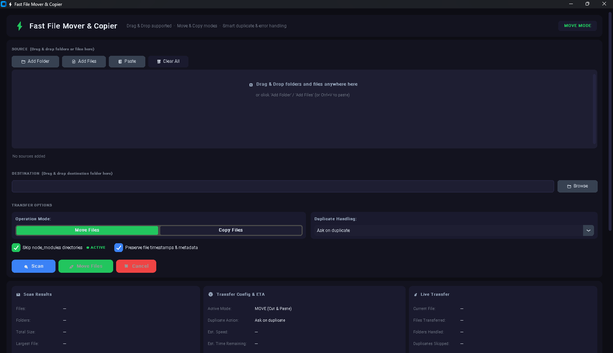
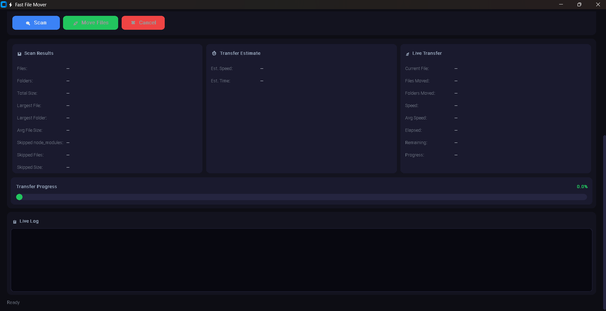
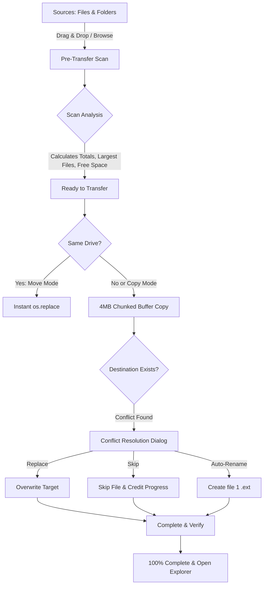

# ⚡ Fast File Mover & Copier

A modern, high-performance Windows file transfer utility built with Python, CustomTkinter, and native Drag & Drop.

Unlike traditional file utilities, **Fast File Mover** focuses on extreme speed, intelligent duplicate handling, developer-friendly exclusions (like `node_modules`), real-time transfer telemetry, and an ultra-clean dark UI.

---

## 🌟 What's New in the Latest Update

- 🔄 **Move vs. Copy Modes**: Toggle dynamically between **Move Mode** (instant same-drive metadata relocation or cross-drive move with verified source cleanup) and **Copy Mode** (preserves original files).
- 🖱️ **Native Drag & Drop**: Drag files and folders directly from Windows Explorer into the source list or destination drop card. Built with a crash-proof native Tcl/Tk OLE architecture compatible with **Python 3.11 through Python 3.14+**.
- 🔀 **Interactive Conflict Resolution ("Apply to All")**:
  - Side-by-side comparison modal displaying file sizes, modification timestamps, parent folders, and smart hints (e.g., *"Source file is newer"*).
  - Quick action buttons: **Replace**, **Skip**, **Auto-Rename** (`file (1).ext`), or **Cancel**.
  - One-click **"Apply this decision to all remaining duplicate conflicts"** checkbox for hands-free bulk handling.
  - Dropdown preset support: *Ask on duplicate*, *Skip duplicates*, *Replace / Overwrite*, or *Auto-rename*.
- 🛡️ **Advanced Error Handling & Recovery**:
  - **Pre-flight Disk Space Checking**: Warns immediately if destination free space is insufficient before transfer begins.
  - **Read-Only Attribute Clearing**: Automatically clears Windows read-only flags (`stat.S_IWRITE`) to eliminate `[WinError 5] Access Denied` errors.
  - **Interactive Error Recovery**: Modal dialog offering **Retry**, **Skip**, or **Abort** with **"Apply to all future errors"**.
- 📊 **Glitch-Free Progress Telemetry**:
  - Fully synchronized byte accounting: Skipped and errored files are continuously calculated into overall progress, guaranteeing the progress bar never gets stuck on duplicate skips and smoothly completes to 100%.
  - Real-time speed (MB/s), average throughput, elapsed time, and dynamic ETA remaining countdown.
- 🕒 **Metadata Preservation**: Optional toggle to preserve original file timestamps and metadata using `shutil.copystat`.

---

## 🚀 Key Features

### Performance & Engine
- ⚡ **Instant Same-Drive Move**: Moves gigabytes of files in milliseconds using atomic `os.replace()` when source and destination share the same filesystem volume.
- 💾 **High-Speed Buffered Streaming**: High-throughput 4 MB chunked buffer streaming for cross-drive transfers.
- 🧹 **Node Modules Exclusion**: Optional toggle to instantly skip heavy `node_modules` folders, saving minutes of unnecessary I/O.
- 🧼 **Clean Folder Cleanup**: Recursively prunes empty source directory structures after moving files.

### Workflow & Interface
- 📂 **Multi-Source Support**: Mix and match multiple source folders and individual standalone files in a single batch.
- 📁 **Preserved Directory Hierarchies**: Keeps full nested folder structures when copying or moving directories.
- 📋 **Live Activity Log**: Integrated console box streaming real-time status and transfer events with timestamps.
- 📋 **Clipboard Paste**: Press `Ctrl+V` to instantly paste copied file or folder paths into the source queue.
- ❌ **Instant Cancellation**: Stop any scan or transfer anytime with graceful cleanup of temporary transfer files.
- 🌙 **Modern Dark UI**: Polished CustomTkinter interface styled with curated cyberpunk-inspired slate tones.

---

## 📸 Preview





---

## 🛠️ How It Works



### 1. Pre-Transfer Scan
Recursively analyzes all selected sources to compute:
- Total file and directory count
- Total aggregate transfer payload
- Largest individual file & folder
- Average file size
- Available free space on destination volume

### 2. Smart Transfer Engine
- **Same Drive (Move)**: Executes atomic metadata relocation (`os.replace()`), moving files almost instantaneously.
- **Cross-Drive or Copy**: Employs safe temporary streaming (`.tmp_...`) followed by atomic rename and optional source unlinking.

### 3. Conflict & Error Engine
- Detects existing files at destination before touching data.
- Evaluates preset policy or prompts via the interactive **Conflict Dialog**.
- Automatically credits skipped duplicate bytes to progress to ensure smooth ETA calculation.

---

## 📦 Requirements

- **Operating System**: Windows 10 / 11 (64-bit)
- **Python**: Python 3.11, 3.12, 3.13, or 3.14+
- **Libraries**:
  - `customtkinter`
  - `tkinterdnd2` *(bundled locally or installable via pip)*

---

## 💻 Installation & Usage

### 1. Clone the Repository
```bash
git clone https://github.com/SkyPop18/Fast-File-Mover.git
cd Fast-File-Mover
```

### 2. Install Dependencies
```bash
pip install -r requirements.txt
```

*(Note: If `tkinterdnd2` is included in the project directory, it runs out of the box with zero external drag-and-drop configuration.)*

### 3. Run Application
```bash
python fast_file_mover.py
```

---

## 📄 requirements.txt

```txt
customtkinter>=5.2.0
tkinterdnd2>=0.3.0
```

---

## 👨‍💻 Author

**Akshat Sharma**  
Website & Support: [https://supportme-akshat.netlify.app/](https://supportme-akshat.netlify.app/)

---

## 📜 License

This project is licensed under the [MIT License](LICENSE).
